# UIAO-Core

**Unified Identity-Addressing-Overlay Architecture**  
Modernizing federal systems with machine-readable Zero Trust and FedRAMP compliance automation.

---

## End-to-End Demo

> Run `uiao generate-all` to transform your YAML canon into OSCAL JSON, Markdown docs, DOCX, PPTX, and a CycloneDX SBOM in a single command.

---

## Modernization Atlas

### Core Identity Lifecycle

### Legacy vs Modernized State

---

## Key Architecture Views

---

## FedRAMP / OSCAL Tool Comparison

| Capability | **uiao-core** | Compliance Trestle | GoComply | GovReady-Q | GSA fedramp-automation | Paramify | Xacta |
|---|:---:|:---:|:---:|:---:|:---:|:---:|:---:|
| OSCAL SSP generation | ✅ | ✅ | ✅ | ✅ | ✅ | ✅ | ✅ |
| OSCAL POA&M generation | ✅ | ✅ | ⚠️ partial | ✅ | ✅ | ✅ | ✅ |
| OSCAL Component Definition | ✅ | ✅ | ✅ | ⚠️ partial | ✅ | ⚠️ partial | ⚠️ partial |
| **Single YAML canon → OSCAL + PPTX** | ✅ **unique** | ❌ | ❌ | ❌ | ❌ | ❌ | ❌ |
| **Leadership briefings (PPTX) auto-sync** | ✅ **unique** | ❌ | ❌ | ❌ | ❌ | ⚠️ manual | ❌ |
| FedRAMP Rev 5 baseline | ✅ | ✅ | ✅ | ✅ | ✅ | ✅ | ✅ |
| Continuous monitoring / telemetry | ✅ | ⚠️ partial | ❌ | ⚠️ partial | ❌ | ⚠️ partial | ✅ |
| Open-source | ✅ | ✅ | ✅ | ✅ | ✅ | ❌ | ❌ |
| Zero-Trust architecture codified | ✅ | ❌ | ❌ | ❌ | ❌ | ❌ | ⚠️ partial |

> **uiao-core's unique value:** A single YAML canon simultaneously renders machine-readable OSCAL compliance artifacts *and* synchronized executive/leadership briefings (PPTX), keeping security documentation and leadership communications always in sync — no other tool in this space does both.

---

## Features

- Single source of truth YAML canon → OSCAL artifacts
- Vendor-neutral abstraction layer
- Automated SSP, POA&M and leadership briefings
- FedRAMP Rev 5 ready

## Quick Start

`powershell
git clone https://github.com/WhalerMike/uiao-core.git
cd uiao-core
``n
Made for federal Zero Trust and compliance modernization
