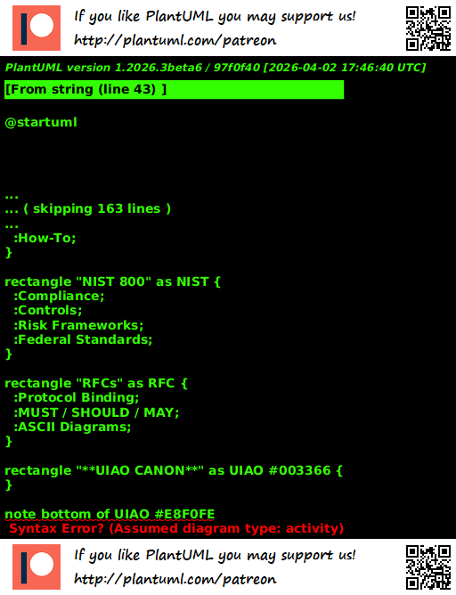

# Technical Documentation Landscape

> Comparative positioning of UIAO Canon within the federal and industry technical documentation ecosystem.

| Field | Value |
|---|---|
| **Version** | 1.0 |
| **Date** | 2026-04-03 |
| **Status** | Active |
| **Image ID** | Image 1-01 |
| **Dimensions** | 512x668 |
| **Renderer** | PlantUML (server-rendered PNG) |
| **Machine-readable** | `data/format-decision-matrix.yml` |

---

## Comparative Landscape

The diagram below positions UIAO Canon as the unifying, governance-grade layer above the four traditional technical documentation families.

---

## Documentation Families

### Cisco Press

- **Domain:** Teaching
- **Strengths:** Narrative-driven explanations, worked examples, real-world scenarios
- **UIAO relationship:** UIAO Canon borrows the narrative clarity of Cisco Press for training materials and story sections, but enforces deterministic structure

### Microsoft Learn

- **Domain:** Instruction
- **Strengths:** Modular tasks, product-specific guidance, step-by-step how-to
- **UIAO relationship:** UIAO Canon adopts the Microsoft Learn modular approach and tone (clear, authoritative, technically precise) as its primary voice standard

### NIST 800

- **Domain:** Compliance
- **Strengths:** Security controls, risk frameworks, federal standards
- **UIAO relationship:** UIAO Canon maps directly to NIST 800-53 Rev 5 controls. All compliance language, crosswalk references, and evidence requirements derive from the NIST framework

### RFCs

- **Domain:** Protocol specification
- **Strengths:** Protocol-binding definitions, MUST/SHOULD/MAY language (RFC 2119), ASCII diagrams
- **UIAO relationship:** UIAO Canon adopts RFC 2119 requirement language for all Contract Requirements sections in technical specifications

---

## UIAO Canon: The Unifying Layer

UIAO Canon sits above these four families as a governance-grade unification layer. It is characterized by:

- **Federated Modernization** — designed for cross-agency, cross-sector adoption
- **Governance Cores** — FIMF alignment, risk registers, KPIs, audit trails
- **Adapter Contracts** — all systems described through canonical adapter interfaces
- **Deterministic** — same inputs produce same outputs, always
- **Provenance-First** — every claim traceable to an authoritative source
- **Claims-Not-Copies** — data is referenced, never duplicated
- **Drift-Resistant** — machine-enforced structural integrity
- **Cross-Sector Integration** — works across federal, state, and commercial boundaries
- **Appendix-Ready** — every document structured for modular appendix attachment
- **No Version Drift** — canonical numbering eliminates structural ambiguity

---

## Related Files

| File | Purpose |
|---|---|
| `data/format-decision-matrix.yml` | When to use which documentation style |
| `docs/governance/format-decision-matrix.qmd` | Human-readable decision matrix |
| `data/style-guide.yml` | Machine-readable style governance |
| `docs/STYLE-GUIDE.qmd` | Human-readable style guide |
